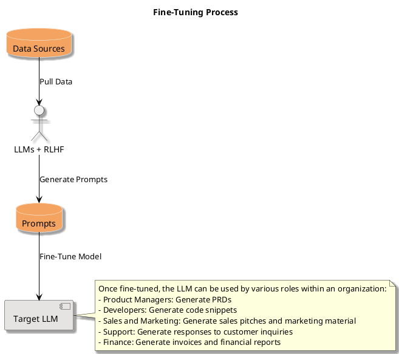

# 🧠 geniusrise

Welcome to geniusrise, a powerful command-line tool that is part of the
Geniusrise project. This tool is designed to pull data from various sources,
format it, and create and manage fine-tuned Language Learning Models (LLMs).

## 📚 Structure

The `geniusrise` tool is structured into several modules, each responsible for a
specific task:

- `main.py`: The main entry point for the tool.
- `config.py`: Contains configuration settings for the tool.
- `logging.py`: Handles logging for the tool.
- `cmdline.py`: Handles command line arguments and options.

### Preprocessing

The preprocessing module is responsible for formatting data for use with
different language learning models:

- `huggingface.py`: Preprocessing for Hugging Face models.
- `openai.py`: Preprocessing for OpenAI models.
- `google_palm.py`: Preprocessing for Google PALM models.
- `prompts.py`: Handles the creation of prompts for the models.

### Data Sources

The data sources module contains submodules for each type of data source that
the tool can pull data from. Each submodule contains scripts for different
platforms within that category:

- `document_management`: Scripts for platforms like Confluence, Google Drive,
  Dropbox, and Notion.
- `project_management`: Scripts for platforms like Jira, ClickUp, Asana, and
  Basecamp.
- `communication`: Scripts for platforms like Discord, Slack, and Microsoft
  Teams.
- `code_hosting`: Scripts for platforms like Bitbucket Cloud, GitHub, GitLab,
  Bitbucket Server, and Static.
- `customer_support`: Scripts for platforms like Intercom, Freshdesk, and
  Zendesk.
- `crm`: Scripts for platforms like Zoho, Salesforce, and Hubspot.

### Compute DAG

The compute DAG (Directed Acyclic Graph) module contains scripts for handling
the computation graph of the tool:

- `node.py`: Handles the nodes of the computation graph.
- `edge.py`: Handles the edges of the computation graph.
- `dsl.py`: Contains the domain-specific language for the computation graph.
- `types.py`: Contains the types used in the computation graph.

### LLM

The LLM (Language Learning Models) module contains scripts for handling
different language learning models:

- `huggingface.py`: Handles the Hugging Face model.
- `chatgpt.py`: Handles the ChatGPT model.
- `bard.py`: Handles the Bard model.
- `base.py`: Base module for the LLMs.
- `types.py`: Contains the types used in the LLMs.
- `utils`: Contains utility scripts for the LLMs, like `training_args.py` for
  handling training arguments.

## 🌐 Data Platforms

geniusrise integrates with a wide range of data platforms across various
categories:

| Communication                    | Project Management            | Document Management                 | Code Hosting                      | Customer Support                  | CRM                                |
| -------------------------------- | ----------------------------- | ----------------------------------- | --------------------------------- | --------------------------------- | ---------------------------------- |
| Discord (Chat for communities)   | ClickUp (Task management)     | Dropbox (Cloud storage)             | GitLab (DevOps tool)              | Zendesk (Customer service)        | Zoho (Online office suite)         |
| Slack (Messaging platform)       | Jira (Issue tracking)         | Notion (Notes and databases)        | Static (Code hosting)             | Intercom (Customer communication) | HubSpot (Marketing and sales)      |
| Microsoft Teams (Workplace chat) | Asana (Work management)       | Google Drive (File storage)         | Bitbucket Server (Git repository) | Freshdesk (Customer support)      | Salesforce (Customer relationship) |
|                                  | Basecamp (Project management) | Confluence (Collaboration software) | GitHub (Developer platform)       |                                   |                                    |

## 🎯 Application of Fine-Tuned LLMs

Once the target LLM is trained, it can be used by various roles within an
organization to assist with their specific tasks. Here are some examples:

- **Product Managers**: Generate Product Requirement Documents (PRDs) using the
  LLM. For instance, the LLM can be used to draft the initial version of a PRD,
  which can then be refined by the product manager.

- **Developers**: Generate code snippets or pseudocode to help with development
  tasks. For example, a developer could input a high-level description of a
  function into the LLM, and the LLM could output a rough draft of the function
  in code.

- **Sales and Marketing**: Generate sales pitches, marketing material, or
  customer emails. For instance, a salesperson could use the LLM to generate a
  pitch for a new product, or a marketer could use it to draft a new blog post
  or social media update.

- **Support**: Generate responses to common customer inquiries. For example, a
  support agent could use the LLM to quickly draft responses to frequently asked
  questions.

- **Finance**: Generate invoices or financial reports. For instance, a finance
  team member could use the LLM to draft an invoice for a customer, or to
  generate a first draft of a financial report.

By fine-tuning the LLMs to your organization's specific needs, you can create a
powerful tool that assists with a wide range of tasks across your organization.

## 🔄 Preprocessing

The tool includes modules for preprocessing data:

- `prompts.py`: Handles prompts in preprocessing.
- `openai.py`: Preprocesses data for OpenAI.
- `google_palm.py`: Preprocesses data for Google PALM.

## 🎛️ Fine-Tuning Process

The fine-tuning process in geniusrise involves pulling data from various
sources, piping them into various LLMs to generate prompts, and then using these
prompts to fine-tune the target model. Here's a PlantUML diagram to illustrate
the process:

  
🔽

## 🚀 Getting Started

To get started with `geniusrise`, clone the repository and install the necessary
dependencies.

## 🤝 Contributing

We welcome contributions to the `geniusrise` tool. If you're interested in
contributing, please take a look at our open issues and submit a pull request
when you're ready.

## 📜 License

geniusrise is open-source software licensed under [LICENSE].

## 📞 Contact

If you have any questions or suggestions, please feel free to reach out to us at
[CONTACT INFORMATION].

Join us on this exciting journey to create "geniuses"! 🎉
