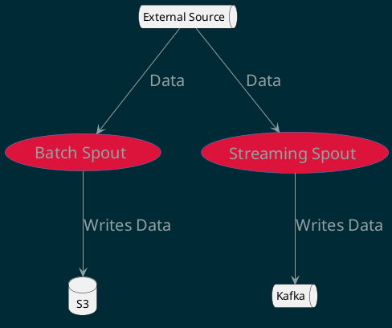
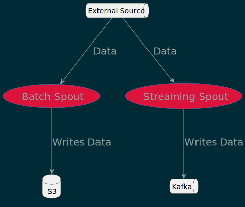
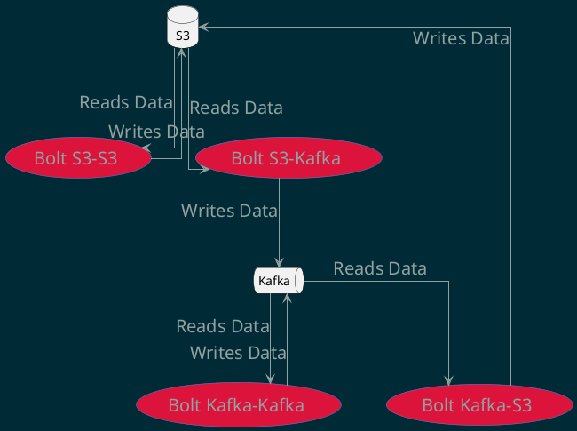

<!-- START doctoc generated TOC please keep comment here to allow auto update -->
<!-- DON'T EDIT THIS SECTION, INSTEAD RE-RUN doctoc TO UPDATE -->

**Table of Contents**

- [Design Document for Distributed Computation Framework](#design-document-for-distributed-computation-framework)
  - [Overview](#overview)
  - [Entities](#entities)
    - [Tasks](#tasks)
    - [Spouts](#spouts)
    - [Bolts](#bolts)
  - [State Managers](#state-managers)
  - [Task Managers](#task-managers)
  - [Infrastructure](#infrastructure)
  - [Workflow](#workflow)
- [Usage Examples](#usage-examples)
  - [Example 1: Batch Processing with S3](#example-1-batch-processing-with-s3)
  - [Example 2: Streaming Processing with Kafka](#example-2-streaming-processing-with-kafka)

<!-- END doctoc generated TOC please keep comment here to allow auto update -->

# Design Document for Distributed Computation Framework

## Overview

The distributed computation framework is designed to support both batch and
streaming data processing Directed Acyclic Graphs (DAGs). The framework is
composed of tasks, which can be of two types: spouts or bolts. Spouts are
responsible for reading data from an external source and writing it to a storage
system, while bolts read data from a storage system, perform some operation on
it, and write the results back to the storage system. The framework also
includes various types of Input and Output Configurations, State Managers, and
Task Managers.

## Entities

### Tasks

Tasks are the fundamental units of work in the framework. They can be of two
types: spouts or bolts. Each task takes a set of configurations that dictate its
behavior and data handling. The configurations can be either Batch or Streaming
type.

- BatchInputConfig/BatchOutputConfig: Used for batch processing. It includes
  configurations like input/output folder, bucket, S3 folder, etc.

- StreamingInputConfig/StreamingOutputConfig: Used for streaming processing. It
  includes configurations like Kafka topic, Kafka broker, etc.

- InputConfig/OutputConfig: General configurations that can be used for both
  batch and streaming processing.

### Spouts

Spouts are tasks that read data from an external source. They can be of two
types:

1. **Batch Spouts**: These spouts read from a data source and write the data
   into S3. They are generally invoked using an external cron or orchestrator
   and run at configured intervals.

2. **Streaming Spouts**: These spouts read from an external source and dump the
   data into Kafka. The external sources are usually asynchronous events like
   HTTP or TCP ports or another Kafka. Streaming spouts are generally
   forever-running.

<details>
  <summary>Diagram code</summary>



</details>



### Bolts

Bolts are tasks that read data from a storage system, perform some operation on
it, and write the results back to the storage system. They can be of four types:

1. Bolts that read from S3, perform some operation on the data, and write to S3.
2. Bolts that read from Kafka, perform some operation on the data, and write to
   Kafka.
3. Bolts that read from Kafka, perform some operation on the data, and write to
   S3 at regular configured intervals.
4. Bolts that read from S3, perform some operation on the data, and write to
   Kafka at regular configured intervals.

<details>
  <summary>Diagram code</summary>



</details>


## State Managers

State Managers are responsible for maintaining the state of the tasks. They can
be of various types:

1. DynamoDBStateManager
2. InMemoryStateManager
3. PostgresStateManager
4. RedisStateManager

Each State Manager provides an interface to a specific type of database or
in-memory storage system.

## Task Managers

Task Managers are responsible for managing the execution of tasks. They can be
of various types:

1. ECSManager
2. K8sManager

Each Task Manager provides an interface to a specific type of compute
infrastructure.

## Infrastructure

The framework uses Kubernetes or ECS as the compute framework and Kafka and S3
for handling data. The data handling is abstracted away from the user, making
the framework easy to use.

## Workflow

The user interacts with the framework using a CLI tool, `geniusrise`. The
workflow is as follows:

1. The user writes a YAML file describing their data pipeline.
2. The user calls `geniusrise`, which reads the YAML file and generates
   Kubernetes or ECS deployment and service files.
3. The user applies the generated Kubernetes or ECS files.

The `geniusrise` tool is also used to run any task, meaning it can be used as a
management and creation system. It is packaged as a Docker container, allowing
it to be run in any pod.

# Usage Examples

## Example 1: Batch Processing with S3

In this example, we will use a batch spout to read data from an external source
and write it to an S3 bucket. We will then use a bolt to read the data from the
S3 bucket, perform some operation, and write the results back to the S3 bucket.

1. **Create a YAML file for the pipeline**

```yaml
tasks:
  - name: batch-spout
    type: spout
    config:
      inputConfig:
        type: batch
        source: external-source-url
      outputConfig:
        type: batch
        destination: s3://my-bucket/data

  - name: bolt
    type: bolt
    config:
      inputConfig:
        type: batch
        source: s3://my-bucket/data
      outputConfig:
        type: batch
        destination: s3://my-bucket/results
```

2. **Generate the deployment files**

```bash
geniusrise generate pipeline.yaml
```

3. **Apply the deployment files**

```bash
geniusrise apply -f pipeline.yaml
```

## Example 2: Streaming Processing with Kafka

In this example, we will use a streaming spout to read data from an external
source and write it to a Kafka topic. We will then use a bolt to read the data
from the Kafka topic, perform some operation, and write the results back to the
Kafka topic.

1. **Create a YAML file for the pipeline**

```yaml
tasks:
  - name: streaming-spout
    type: spout
    config:
      inputConfig:
        type: streaming
        source: external-source-url
      outputConfig:
        type: streaming
        destination: kafka-topic-1

  - name: bolt
    type: bolt
    config:
      inputConfig:
        type: streaming
        source: kafka-topic-1
      outputConfig:
        type: streaming
        destination: kafka-topic-2
```

2. **Generate the deployment files**

```bash
geniusrise generate pipeline.yaml
```

3. **Apply the deployment files**

```bash
geniusrise apply pipeline.yaml
```

These examples demonstrate how to use the distributed computation framework for
both batch and streaming data processing. The `geniusrise` tool makes it easy to
define and deploy your data pipelines.
