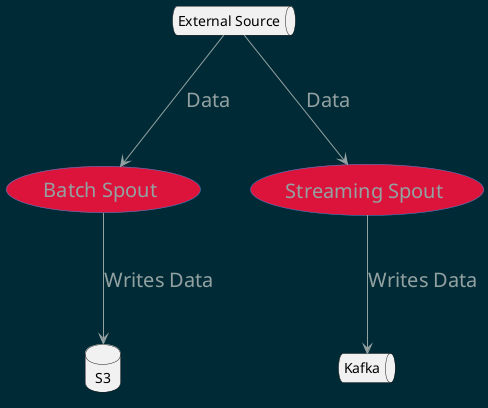
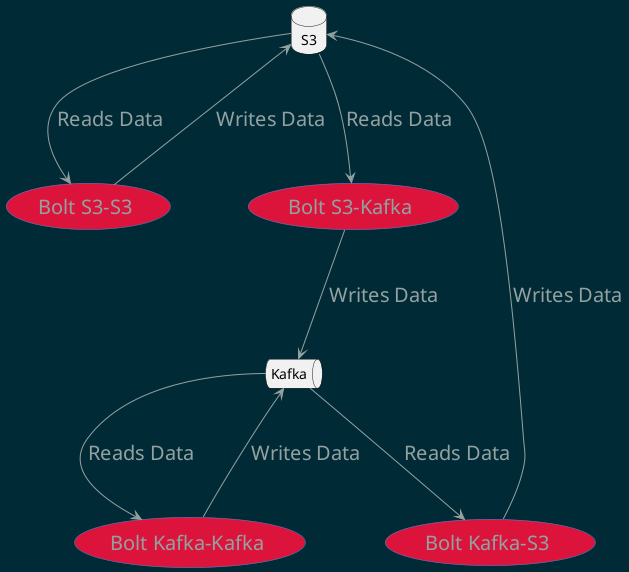

<!-- START doctoc generated TOC please keep comment here to allow auto update -->
<!-- DON'T EDIT THIS SECTION, INSTEAD RE-RUN doctoc TO UPDATE -->

**Table of Contents**

- [Design Document for Distributed Computation Framework](#design-document-for-distributed-computation-framework)
  - [Overview](#overview)
  - [Entities](#entities)
    - [Tasks](#tasks)
    - [Spouts](#spouts)
    - [Bolts](#bolts)
  - [Infrastructure](#infrastructure)
  - [Workflow](#workflow)
  - [Conclusion](#conclusion)

<!-- END doctoc generated TOC please keep comment here to allow auto update -->

# Design Document for Distributed Computation Framework

## Overview

The proposed distributed computation framework is designed to support both batch
and streaming data processing Directed Acyclic Graphs (DAGs). The framework is
composed of tasks, which can be of two types: spouts or bolts. Spouts are
responsible for reading data from an external source and writing it to a storage
system, while bolts read data from a storage system, perform some operation on
it, and write the results back to the storage system.

## Entities

### Tasks

Tasks are the fundamental units of work in the framework. They can be of two
types: spouts or bolts. Each task takes a set of configurations that dictate its
behavior and data handling.

### Spouts

Spouts are tasks that read data from an external source. They can be of two
types:

1. **Batch Spouts**: These spouts read from a data source and write the data
   into S3. They are generally invoked using an external cron or orchestrator
   and run at configured intervals.
2. **Streaming Spouts**: These spouts read from an external source and dump the
   data into Kafka. The external sources are usually asynchronous events like
   HTTP or TCP ports or another Kafka. Streaming spouts are generally
   forever-running.

### Bolts

Bolts are tasks that read data from a storage system, perform some operation on
it, and write the results back to the storage system. They can be of four types:

1. Bolts that read from S3, perform some operation on the data, and write to S3.
2. Bolts that read from Kafka, perform some operation on the data, and write to
   Kafka.
3. Bolts that read from Kafka, perform some operation on the data, and write to
   S3 at regular configured intervals.
4. Bolts that read from S3, perform some operation on the data, and write to
   Kafka at regular configured intervals.

## Infrastructure

The framework uses Kubernetes as the compute framework and Kafka and S3 for
handling data. The data handling is abstracted away from the user, making the
framework easy to use.

## Workflow

The user interacts with the framework using a CLI tool, `geniusrise-cli`. The
workflow is as follows:

1. The user writes a YAML file describing their data pipeline.
2. The user calls `geniusrise-cli`, which reads the YAML file and generates
   Kubernetes deployment and service files.
3. The user applies the generated Kubernetes files.

The `geniusrise-cli` tool is also used to run any task, meaning it can be used
as a management and creation system. It is packaged as a Docker container,
allowing it to be run in any pod.

## Conclusion

This design provides a robust, scalable, and user-friendly framework for
distributed computation. It abstracts away the complexities of data handling and
infrastructure management, allowing users to focus on defining and running their
data processing tasks.
